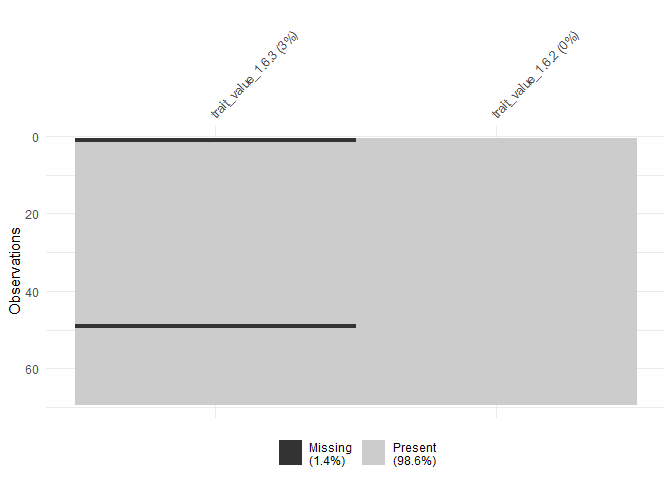

Analysis of Ecological Data <br> 3.1 How to get traits?
================
<b>Markus Bauer</b> <br>
<b>2024-07-10</b>

- [1 Preparation](#1-preparation)
  - [1.1 The example data set](#11-the-example-data-set)
  - [1.2 Load data](#12-load-data)
- [2 Metadata of plant traits of
  GIFT](#2-metadata-of-plant-traits-of-gift)
- [3 Download trait values from
  GIFT](#3-download-trait-values-from-gift)
  - [3.1 How to download traits](#31-how-to-download-traits)
  - [3.2 Download traits of SLA, height, seed
    mass](#32-download-traits-of-sla-height-seed-mass)
- [4 Use TNRS for name resolving](#4-use-tnrs-for-name-resolving)
  - [4.1 Resolve species names of species
    table](#41-resolve-species-names-of-species-table)
  - [4.2 Merge species names to species and traits
    table](#42-merge-species-names-to-species-and-traits-table)
- [5 Check completeness](#5-check-completeness)
- [6 Save your traits table](#6-save-your-traits-table)

<br/> <br/> <b>Markus Bauer</b>

Technichal University of Munich, TUM School of Life Sciences, Chair of
Restoration Ecology, Emil-Ramann-Straße 6, 85354 Freising, Germany

<markus1.bauer@tum.de>

<a href="https://orcid.org/0000-0001-5372-4174">
<https://orcid.org/0000-0001-5372-4174>

[](https://scholar.google.de/citations?user=oHhmOkkAAAAJ&hl=de&oi=ao)
[](https://github.com/markus1bauer)

# 1 Preparation

Load the libraries. You can always install missing libraries by
`install.packages("GIFT")` for the GIFT package.

``` r
library(here)
library(tidyverse)
library(GIFT)
library(TNRS)
library(naniar)
rm(list = ls())
```

## 1.1 The example data set

A study in the Ammer valley before and after the weir in the [floodplain
Schnalz](https://www.openstreetmap.org/#map=16/47.7737/10.9615).

Normally there are alluvial grey alder forests (Alnetum incanae,
alliance [Alnion
incanae](https://floraveg.eu/vegetation/overview/Alnion%20incanae),
EUNIS habitat [T12](https://floraveg.eu/habitat/overview/T12))

Due to the dam along the Ammer and the weir in the Ammer the flood
regime changed and the vegetation could have developed to a maple-ash
forest (‘Edellaubholzwald’) (Adoxo-Aceretum, alliance
[Tilio-Acerion](https://floraveg.eu/vegetation/overview/Tilio-Acerion),
EUNIS habitat type [T1F](https://floraveg.eu/habitat/overview/T1F%3E))

The dataset is also available on GitHub Bauer et al. (2018) Tuexenia
<br>
[](https://doi.org/10.14471/2018.38.006):
<br>
<https://github.com/markus1bauer/2018_alluvial_forest_river_ammer/tree/main>

## 1.2 Load data

``` r
data_species <- read_csv(
  here("data", "raw", "example_course_alluvial_forest_mb", "data_raw_species.csv"),
  col_names = TRUE, col_types = cols(
    .default = "?",
    name = "f",
    layer = "f"
    )
  ) %>%
  select(-contains("Extra")) %>% # exclude some plots
  filter(layer == "h") %>% # filter only species of the herbal layer
  group_by(name) %>%
  mutate(
    sum = sum(c_across(IN1:AC6)),
    presence = if_else(sum > 0, 1, 0)
    ) %>%
  filter(presence == 1) %>% # exclude species which are not present in the remaining plots
  ungroup() %>%
  select(-sum, -presence, -layer)

data_traits <- read_csv(
  here("data", "raw", "example_course_alluvial_forest_mb", "data_raw_traits.csv"),
  col_names = TRUE, col_types = cols(.default = "?")
  ) %>%
  select(name, lifeform) %>%
  filter(!str_detect(lifeform, "wood"))

species <- data_species %>%
  semi_join(data_traits, by = "name") # only herbal species
traits <- data_traits %>%
  semi_join(species, by = "name") # only species which occur in the plots

rm(list = setdiff(ls(), c("species", "traits")))
```

# 2 Metadata of plant traits of GIFT

There are many functional traits available in GIFT. Each of these traits
has an identification number called `trait_ID`. Since the two functions
for retrieving trait values, `GIFT_traits()` and `GIFT_traits_raw()`,
rely on these IDs, the first step is to call the function
`GIFT_traits_meta()` to know what the ID of the desired trait is. For
example, let’s say we want to retrieve the maximum vegetative heights of
plant species.

``` r
trait_meta <- GIFT::GIFT_traits_meta()
trait_meta %>%
  filter(str_detect(Trait2, "height"))
```

    ##   Lvl1     Category Lvl2       Trait1   Lvl3            Trait2 Units    type
    ## 1    1   Morphology  1.6 Plant height  1.6.1  Plant_height_min     m numeric
    ## 2    1   Morphology  1.6 Plant height  1.6.2  Plant_height_max     m numeric
    ## 3    1   Morphology  1.6 Plant height  1.6.3 Plant_height_mean     m numeric
    ## 4    3 Reproduction 3.12  Seed height 3.12.1   Seed_height_min    mm numeric
    ## 5    3 Reproduction 3.12  Seed height 3.12.2   Seed_height_max    mm numeric
    ## 6    3 Reproduction 3.15 Fruit height 3.15.1  Fruit_height_min    cm numeric
    ## 7    3 Reproduction 3.15 Fruit height 3.15.2  Fruit_height_max    cm numeric
    ## 8    3 Reproduction 3.15 Fruit height 3.15.3 Fruit_height_mean    cm numeric
    ##   comment count
    ## 1    <NA> 43353
    ## 2    <NA> 70367
    ## 3    <NA> 23219
    ## 4    <NA>     7
    ## 5    <NA>   148
    ## 6    <NA>    54
    ## 7    <NA>    54
    ## 8    <NA>    54

We can see that the ID of this trait is 1.6.2. Now that we have the ID,
we can use `GIFT_traits()` to retrieve the growth form values for
different plant species.

- Search the IDs of *mean* specific leaf area (SLA), seed mass aand
  plant height.

- Note the categories, IDs and unit for the material-and-methods
  section.

# 3 Download trait values from GIFT

<https://biogeomacro.github.io/GIFT/articles/GIFT.html#trait-data>

## 3.1 How to download traits

There are two functions to access trait values. First,
`GIFT_traits_raw()` returns all trait values for a given species and a
given trait. These trait values can then vary. Second, GIFT_traits()
returns an aggregated trait value at the species level. The aggregation
simply takes the mean for continuous traits or the most frequent entry
for categorical traits. However, for some specific cases, the
aggregation takes either the minimum or the maximum, as for the trait we
chose. Let’s retrieve the raw and aggregated values for the maximum
vegetative height of plants (trait_ID 1.6.2).

``` r
height <- GIFT_traits(
  trait_IDs = c("1.6.2"), agreement = 0.66, bias_ref = FALSE, bias_deriv = FALSE
  )
```

    ## 
    ## Retrieving species' names.

    ## Preparing the download of trait data for 1 trait(s).

    ## 

``` r
height_raw <- GIFT_traits_raw(trait_IDs = c("1.6.2"))

# Raw values
height_raw %>%
  select(work_species, trait_ID, trait_value) %>%
  filter(work_species == "Fagus sylvatica")

# Aggregated value
height %>%
  filter(work_species == "Fagus sylvatica")
```

There were three maximum heights for Fagus sylvatica, 30, 35, and 50
meters, which led to an aggregated value of 50 meters. And if you want
to look up the references that led to the aggregated trait value, you
can run this chunk:

``` r
references <- GIFT_references(GIFT_version = "beta")
```

    ## You are asking for the beta-version of GIFT which is subject to
    ## updates and edits. Consider using 'latest' for the latest stable
    ## version.

``` r
unique(unlist(strsplit(height$references_1.6.2, ",")))
```

    ##  [1] "10342" "10246" "10353" "10111" "10651" "10320" "10352" "10018" "16"   
    ## [10] "10319" "10302" "10315" "10328" "10318" "23"    "263"   "10306" "10247"
    ## [19] "10136" "10244" "10233" "10224" "10053" "10333" "10260" "10027"

``` r
references <- references[
  which(references$ref_ID %in% 
          unique(unlist(strsplit(height$references_1.6.2, ",")))), ]
references[1:2, ]
```

    ##     ref_ID
    ## 68   10651
    ## 234  10352
    ##                                                                                                                        ref_long
    ## 68    Komarov, Shishkin & Bobrov (1933-1964) Flora of the U.S.S.R. Israel Program for Scientific Translations, Springfield, US.
    ## 234 Hutchinson, Dalziel, Keay & Hepper (2014) Flora of West Tropical Africa. Crown agents for overseas governments, London, UK.
    ##     geo_entity_ref      type subset taxon_ID    taxon_name checklist
    ## 68     former USSR     Flora    all        2  Tracheophyta         1
    ## 234    West Africa Checklist    all        5 Spermatophyta         1
    ##     native_indicated natural_indicated end_ref traits restricted  proc_date
    ## 68                 1                 0       1      1          0 2022-03-16
    ## 234                1                 1       0      1          0 2020-04-27

## 3.2 Download traits of SLA, height, seed mass

- Get the aggregated trait values of the mean SLA, plant height and seed
  mass.

Here an example how to download several traits:

``` r
data_gift <- GIFT_traits(
  trait_IDs = c("1.6.2", "1.6.3"), agreement = 0.66, bias_ref = FALSE, bias_deriv = FALSE
  )
```

    ## 
    ## Retrieving species' names.

    ## Preparing the download of trait data for 2 trait(s).

    ## ================================================================================

    ## 

``` r
rm(list = setdiff(ls(), c("species", "traits", "data_gift")))
```

# 4 Use TNRS for name resolving

<https://cran.r-project.org/web/packages/TNRS/vignettes/TNRS_vignette.html>

## 4.1 Resolve species names of species table

``` r
metadata <- TNRS::TNRS_metadata()

data <- species %>%
  rowid_to_column("id") %>%
  select(id, name) %>%
  TNRS::TNRS(
    sources = c("wcvp", "wfo"),
    classification = "wfo",
    mode = "resolve"
  )
names <- data %>%
  select(
    Name_submitted, Taxonomic_status, Accepted_name, Accepted_name_url,
    Accepted_family
    ) %>%
  rename_with(tolower) %>%
  rename(name = name_submitted)
```

- Note the version of the database from metadata\$version and the
  sources of the names with metadata\$citations for the
  material-and-methods section

- Note the range of Overall_score for your submitted species names.

## 4.2 Merge species names to species and traits table

``` r
data <- species %>%
  full_join(names %>% select(name, accepted_name), by = "name") %>%
  select(-name)
species <- data

data <- names %>%
  full_join(traits, by = "name") %>%
  left_join(data_gift %>% rename(accepted_name = work_species), by = "accepted_name")
traits <- data %>%
  select(-work_ID, -work_author, -starts_with("references"))

rm(list = setdiff(ls(), c("species", "traits")))
```

# 5 Check completeness

``` r
traits %>%
  select(trait_value_1.6.2, trait_value_1.6.3) %>%
  naniar::miss_var_summary(order = TRUE)
```

    ## # A tibble: 2 × 3
    ##   variable          n_miss pct_miss
    ##   <chr>              <int>    <num>
    ## 1 trait_value_1.6.3      2     2.90
    ## 2 trait_value_1.6.2      0     0

``` r
traits %>%
  select(trait_value_1.6.2, trait_value_1.6.3) %>%
  naniar::vis_miss(cluster = FALSE, sort_miss = TRUE)
```

<!-- -->

``` r
traits %>%
  select(accepted_name, trait_value_1.6.2, trait_value_1.6.3) %>%
  filter(is.na(trait_value_1.6.2) | is.na(trait_value_1.6.3))
```

    ##         accepted_name trait_value_1.6.2 trait_value_1.6.3
    ## 1 Aconitum lycoctonum                 2                NA
    ## 2 Molinia arundinacea                 2                NA

- Note the number of missing traits and calculate the ratio.

Check for synonyms

``` r
GIFT_species_lookup(genus = "Aconitum", epithet = "lycoctonum")
```

    ## You are asking for the latest stable version of GIFT which is 3.2.

    ##    name_ID    genus species_epithet              subtaxon
    ## 1      899 Aconitum      lycoctonum       subsp. vulparia
    ## 2   108739 Aconitum      lycoctonum                  <NA>
    ## 3   108740 Aconitum      lycoctonum   subsp. neapolitanum
    ## 4   108741 Aconitum      lycoctonum       subsp. vulparia
    ## 5   119572 Aconitum      lycoctonum       subsp. vulparia
    ## 6   141565 Aconitum      altissimum                  <NA>
    ## 7   284621 Aconitum      lycoctonum                  <NA>
    ## 8   539314 Aconitum      lycoctonum   subsp. neapolitanum
    ## 9   539315 Aconitum      lycoctonum       subsp. vulparia
    ## 10  797115 Aconitum      lycoctonum     subsp. lycoctonum
    ## 11  797116 Aconitum      lycoctonum subsp. septentrionale
    ## 12  817908 Aconitum      lycoctonum       subsp. vulparia
    ## 13  870777 Aconitum      lycoctonum      subsp. lycotonum
    ## 14  870999 Aconitum      lycoctonum    subsp. pauciflorum
    ## 15  871191 Aconitum        lupicida                  <NA>
    ## 16  873445 Aconitum      lycoctonum     subsp. lycoctonum
    ## 17  873446 Aconitum      lycoctonum       subsp. vulparia
    ## 18  978970 Aconitum      lycoctonum       subsp. vulparia
    ## 19  979318 Aconitum        lupicida                  <NA>
    ## 20  983598 Aconitum      lycoctonum    subsp. lasiostomum
    ## 21 1061555 Aconitum        lyctonum       subsp. vulparia
    ## 22 1456456 Aconitum      lycoctonum   subsp. neapolitanum
    ##                      author matched epithetscore overallscore resolved synonym
    ## 1                      <NA>       1          1.0        0.600        1       0
    ## 2                        L.       1          1.0        1.000        1       0
    ## 3              (Ten.) Nyman       1          1.0        0.404        1       0
    ## 4             (Rchb.) Nyman       1          1.0        0.429        1       0
    ## 5   (Rchb. ex Spreng.) Ces.       1          1.0        0.356        1       0
    ## 6                     Mill.       1          1.0        1.000        1       1
    ## 7                      <NA>       1          1.0        0.864        1       0
    ## 8               (Ten.) Nym.       1          1.0        0.412        1       0
    ## 9   (Rchb. ex Spreng.) Nym.       1          1.0        0.356        1       0
    ## 10                     <NA>       1          1.0        0.568        1       0
    ## 11          (Koelle) Korsh.       1          1.0        0.368        1       0
    ## 12             (Rchb.) Ces.       1          1.0        0.438        1       0
    ## 13                     <NA>       1          1.0        0.583        1       0
    ## 14                     <NA>       1          1.0        0.553        1       0
    ## 15                     <NA>       1          1.0        0.739        1       1
    ## 16                       L.       1          1.0        0.550        1       0
    ## 17 (Rchb. ex Spreng.) Nyman       1          1.0        0.350        1       0
    ## 18           (Spreng.) Ces.       1          1.0        0.420        1       0
    ## 19                    Rchb.       1          1.0        1.000        1       1
    ## 20       (Besser) K.Warncke       1          1.0        0.368        1       0
    ## 21                    Nyman       1          0.8        0.436        1       0
    ## 22                     <NA>       1          1.0        0.538        1       0
    ##    matched_subtaxon accepted   service work_ID taxon_ID work_genus
    ## 1                 0        1 GIFT_wcvp   56755     1006   Aconitum
    ## 2                 0        1 GIFT_wcvp   56755     1006   Aconitum
    ## 3                 0        1 GIFT_wcvp   56755     1006   Aconitum
    ## 4                 0        1 GIFT_wcvp   56755     1006   Aconitum
    ## 5                 0        1 GIFT_wcvp   56755     1006   Aconitum
    ## 6                 0        1 GIFT_wcvp   56755     1006   Aconitum
    ## 7                 0        1 GIFT_wcvp   56755     1006   Aconitum
    ## 8                 0        1 GIFT_wcvp   56755     1006   Aconitum
    ## 9                 0        1 GIFT_wcvp   56755     1006   Aconitum
    ## 10                0        1 GIFT_wcvp   56755     1006   Aconitum
    ## 11                0        1 GIFT_wcvp   56755     1006   Aconitum
    ## 12                0        1 GIFT_wcvp   56755     1006   Aconitum
    ## 13                0        1 GIFT_wcvp   56755     1006   Aconitum
    ## 14                0        1 GIFT_wcvp   56755     1006   Aconitum
    ## 15                0        1 GIFT_wcvp   56755     1006   Aconitum
    ## 16                0        1 GIFT_wcvp   56755     1006   Aconitum
    ## 17                0        1 GIFT_wcvp   56755     1006   Aconitum
    ## 18                0        1 GIFT_wcvp   56755     1006   Aconitum
    ## 19                0        1 GIFT_wcvp   56755     1006   Aconitum
    ## 20                0        1 GIFT_wcvp   56755     1006   Aconitum
    ## 21                0        1 GIFT_wcvp   56755     1006   Aconitum
    ## 22                0        1 GIFT_wcvp   56755     1006   Aconitum
    ##    work_species_epithet        work_species work_author
    ## 1            lycoctonum Aconitum lycoctonum          L.
    ## 2            lycoctonum Aconitum lycoctonum          L.
    ## 3            lycoctonum Aconitum lycoctonum          L.
    ## 4            lycoctonum Aconitum lycoctonum          L.
    ## 5            lycoctonum Aconitum lycoctonum          L.
    ## 6            lycoctonum Aconitum lycoctonum          L.
    ## 7            lycoctonum Aconitum lycoctonum          L.
    ## 8            lycoctonum Aconitum lycoctonum          L.
    ## 9            lycoctonum Aconitum lycoctonum          L.
    ## 10           lycoctonum Aconitum lycoctonum          L.
    ## 11           lycoctonum Aconitum lycoctonum          L.
    ## 12           lycoctonum Aconitum lycoctonum          L.
    ## 13           lycoctonum Aconitum lycoctonum          L.
    ## 14           lycoctonum Aconitum lycoctonum          L.
    ## 15           lycoctonum Aconitum lycoctonum          L.
    ## 16           lycoctonum Aconitum lycoctonum          L.
    ## 17           lycoctonum Aconitum lycoctonum          L.
    ## 18           lycoctonum Aconitum lycoctonum          L.
    ## 19           lycoctonum Aconitum lycoctonum          L.
    ## 20           lycoctonum Aconitum lycoctonum          L.
    ## 21           lycoctonum Aconitum lycoctonum          L.
    ## 22           lycoctonum Aconitum lycoctonum          L.

``` r
GIFT_species_lookup(genus = "Molinia", epithet = "arundinacea")
```

    ## You are asking for the latest stable version of GIFT which is 3.2.

    ##    name_ID   genus species_epithet           subtaxon                   author
    ## 1    47125 Molinia        caerulea subsp. arundinacea                     <NA>
    ## 2   110330 Molinia        caerulea subsp. arundinacea       (Schrank) K.Richt.
    ## 3   119978 Molinia     arundinacea               <NA>                  Schrank
    ## 4   142453 Molinia       litoralis               <NA>                     Host
    ## 5   239850 Molinia       litoralis               <NA>                     <NA>
    ## 6   298399 Molinia        caerulea subsp. arundinacea      (Schrank) K. Richt.
    ## 7   539354 Molinia        caerulea subsp. arundinacea (Schrank) H. K. G. Paul.
    ## 8   598407 Molinia     arundinacea               <NA>                     <NA>
    ## 9   758958 Molinia        caerulea   subsp. altissima             (Link) Domin
    ## 10  798893 Molinia        caerulea subsp. arundinacea  (Schrank) H. K. G. Paul
    ## 11  819261 Molinia        caerulea subsp. arundinacea     (Schrank) H.K.G.Paul
    ##    matched epithetscore overallscore resolved synonym matched_subtaxon accepted
    ## 1        1            1        0.648        1       1                0        1
    ## 2        1            1        1.000        1       1                0        1
    ## 3        1            1        1.000        1       0                0        1
    ## 4        1            1        1.000        1       1                0        1
    ## 5        1            1        0.773        1       1                0        1
    ## 6        1            1        0.982        1       1                0        1
    ## 7        1            1        0.817        1       1                0        1
    ## 8        1            1        0.704        1       0                0        1
    ## 9        1            1        1.000        1       1                0        1
    ## 10       1            1        0.814        1       1                0        1
    ## 11       1            1        0.857        1       1                0        1
    ##      service work_ID taxon_ID work_genus work_species_epithet
    ## 1  GIFT_wcvp  441301     4762    Molinia          arundinacea
    ## 2  GIFT_wcvp  441301     4762    Molinia          arundinacea
    ## 3  GIFT_wcvp  441301     4762    Molinia          arundinacea
    ## 4  GIFT_wcvp  441301     4762    Molinia          arundinacea
    ## 5  GIFT_wcvp  441301     4762    Molinia          arundinacea
    ## 6  GIFT_wcvp  441301     4762    Molinia          arundinacea
    ## 7  GIFT_wcvp  441301     4762    Molinia          arundinacea
    ## 8  GIFT_wcvp  441301     4762    Molinia          arundinacea
    ## 9  GIFT_wcvp  441301     4762    Molinia          arundinacea
    ## 10 GIFT_wcvp  441301     4762    Molinia          arundinacea
    ## 11 GIFT_wcvp  441301     4762    Molinia          arundinacea
    ##           work_species work_author
    ## 1  Molinia arundinacea     Schrank
    ## 2  Molinia arundinacea     Schrank
    ## 3  Molinia arundinacea     Schrank
    ## 4  Molinia arundinacea     Schrank
    ## 5  Molinia arundinacea     Schrank
    ## 6  Molinia arundinacea     Schrank
    ## 7  Molinia arundinacea     Schrank
    ## 8  Molinia arundinacea     Schrank
    ## 9  Molinia arundinacea     Schrank
    ## 10 Molinia arundinacea     Schrank
    ## 11 Molinia arundinacea     Schrank

# 6 Save your traits table

``` r
write_csv(species, here("data", "processed", "data_processed_species.csv"))
write_csv(traits, here("data", "processed", "data_processed_traits.csv"))
```
