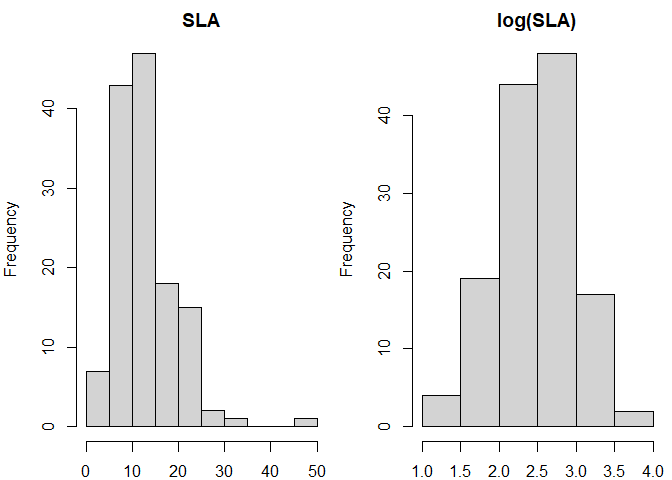
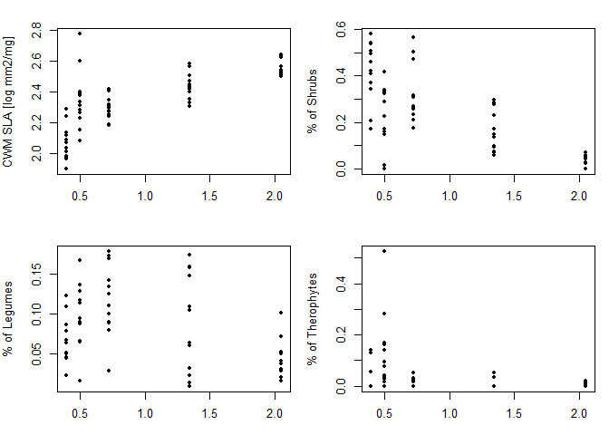
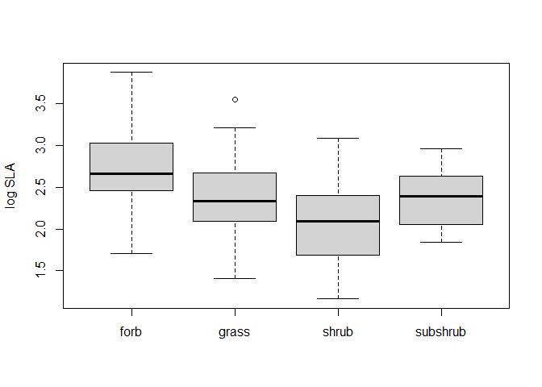

Analysis of Ecological Data <br> 3.4 Community Weighted Mean
================
<b>Markus Bauer</b> <br>
<b>2024-07-17</b>

- [Tasks](#tasks)
- [1 Preparation](#1-preparation)
  - [1.1 The example data set](#11-the-example-data-set)
  - [1.2 Load data](#12-load-data)
- [2 Calculation of CWM](#2-calculation-of-cwm)
  - [2.1 Calculation with invented
    data](#21-calculation-with-invented-data)
  - [2.2 Calculation with real data](#22-calculation-with-real-data)

**Markus Bauer**

Technichal University of Munich, TUM School of Life Sciences, Chair of
Restoration Ecology, Emil-Ramann-Straße 6, 85354 Freising, Germany

<markus1.bauer@tum.de>

<https://orcid.org/0000-0001-5372-4174>

[](https://scholar.google.de/citations?user=oHhmOkkAAAAJ&hl=de&oi=ao)
[](https://github.com/markus1bauer)

# Tasks

- Test script

This script uses parts from [Bello et
al. (2021)](https://doi.org/10.1017/9781108628426)

# 1 Preparation

Load the libraries.

``` r
library(here)
library(tidyverse)
library(FD)
rm(list = ls())
```

## 1.1 The example data set

A study in the Ammer valley before and after the weir in the [floodplain
Schnalz](https://www.openstreetmap.org/#map=16/47.7737/10.9615).

Normally there are alluvial grey alder forests (Alnetum incanae,
alliance [Alnion
incanae](https://floraveg.eu/vegetation/overview/Alnion%20incanae),
EUNIS habitat [T12](https://floraveg.eu/habitat/overview/T12))

Due to the dam along the Ammer and the weir in the Ammer the flood
regime changed and the vegetation could have developed to a maple-ash
forest (‘Edellaubholzwald’) (Adoxo-Aceretum, alliance
[Tilio-Acerion](https://floraveg.eu/vegetation/overview/Tilio-Acerion),
EUNIS habitat type [T1F](https://floraveg.eu/habitat/overview/T1F%3E))

The dataset is also available on GitHub (Bauer et al. 2018)

[](https://doi.org/10.14471/2018.38.006)

<https://github.com/markus1bauer/2018_alluvial_forest_river_ammer/tree/main>

## 1.2 Load data

``` r
species <- read_csv(
  here("data", "processed", "data_processed_species.csv"),
  col_names = TRUE, col_types = cols(
    .default = "?",
    name = "f"
    )
  )
```

    ## Warning: The following named parsers don't match the column names: name

``` r
traits <- read_csv(
  here("data", "processed", "data_processed_traits.csv"),
  col_names = TRUE, col_types = cols(.default = "?")
  )


comm1 <- c(10, 10, 10, 10, 10, 0, 0)
comm2 <- c(49, 0, 5, 0, 5, 0, 11)
comm3 <- c(0, 6, 0, 4, 0, 2, 8)
spxcom.matrix <- cbind(comm1, comm2, comm3)
rownames(spxcom.matrix) <- paste("species", 1:7)

Bodysize <- c(10, 20, 30, 40, 50, NA, 70)
Carnivory <- c(1, 1, 0, 1, 0, 1, 0)
spxtraits.matrix <- cbind(Bodysize, Carnivory)
rownames(spxtraits.matrix) <- paste("species", 1:7)

spxp <- read.table(here::here("data", "raw", "bello_etal-2021", "chapter5", "speciesXplotsNE.txt"), row.names = 1, header = T, check.names = F)
spxt <- read.table(here::here("data", "raw", "bello_etal-2021", "chapter5", "speciesXtraitsNE.txt"), row.names = 1, header = T)
envxp <- read.table(here::here("data", "raw", "bello_etal-2021", "chapter5", "environXplotsNE.txt"), row.names = 1, header = T)
```

# 2 Calculation of CWM

## 2.1 Calculation with invented data

Let’s start by recreating the example at Fig. 5.2 in the reference book.
To do this let’s create first some ‘species x community’ matrix and then
the ‘species x traits’ matrix. *Notice* that we will start computing
everything by hand, to learn the overall process, although existing
functions in R can be used instead much more simply (see later in the
section).

``` r
spxcom.matrix
```

    ##           comm1 comm2 comm3
    ## species 1    10    49     0
    ## species 2    10     0     6
    ## species 3    10     5     0
    ## species 4    10     0     4
    ## species 5    10     5     0
    ## species 6     0     0     2
    ## species 7     0    11     8

``` r
spxtraits.matrix
```

    ##           Bodysize Carnivory
    ## species 1       10         1
    ## species 2       20         1
    ## species 3       30         0
    ## species 4       40         1
    ## species 5       50         0
    ## species 6       NA         1
    ## species 7       70         0

As you can see this data reflects an hypothetical case of a dataset with
a total of 3 communities, containing a total of 7 species, for which we
have data for 2 traits, body size and whether species are carnivourous
(1=yes) or not (0=no). Species 6 has missing data for body size.

To compute CWM we first need the relative abundance of the species in
each community. For this we need first to compute the total abundance in
each community for example as:

``` r
totalabb <- colSums(spxcom.matrix)
totalabb
```

    ## comm1 comm2 comm3 
    ##    50    70    20

Then, we need to divide the abundance of each species in each plot by
the total abundance of the plot. In R it could be done as following
(notice that, because of the way R handle matrix operation the matrix
needs to be transposed in this case; notice also that the sum of the
relative abundances within a plot should be equal to 1, as we show):

``` r
sp.rel.abb <- t(spxcom.matrix) / totalabb #you need to transpose the matrix here
t(sp.rel.abb) #we just transpose the matrix "back", to display it as in the book
```

    ##           comm1      comm2 comm3
    ## species 1   0.2 0.70000000   0.0
    ## species 2   0.2 0.00000000   0.3
    ## species 3   0.2 0.07142857   0.0
    ## species 4   0.2 0.00000000   0.2
    ## species 5   0.2 0.07142857   0.0
    ## species 6   0.0 0.00000000   0.1
    ## species 7   0.0 0.15714286   0.4

``` r
colSums(t(sp.rel.abb)) #this is the total sum of relative abundances in each plot
```

    ## comm1 comm2 comm3 
    ##     1     1     1

As we discuss it in the book (Chapter 5 for example), because the
*presence of a missing value (NA)* in the trait matrix we will have some
*problems*. In particular species 6 is present in community 3, with a
relative abundance of 0.1 (i.e. 10%). Because we do not have data about
body size for this species, we need to remove the species from community
3 and compute new relative abundances (because the sum of relative
abundance still needs to be sum 1). To do this, for example, we can:

``` r
spxcom.matrix.nosp6 <- spxcom.matrix #create a copy of the species x community matrix
spxcom.matrix.nosp6["species 6",] <-  0 #put zero for species 6 in all communities
sp.rel.abb.nosp6 <- t(spxcom.matrix.nosp6) / colSums(spxcom.matrix.nosp6)
t(sp.rel.abb.nosp6)
```

    ##           comm1      comm2     comm3
    ## species 1   0.2 0.70000000 0.0000000
    ## species 2   0.2 0.00000000 0.3333333
    ## species 3   0.2 0.07142857 0.0000000
    ## species 4   0.2 0.00000000 0.2222222
    ## species 5   0.2 0.07142857 0.0000000
    ## species 6   0.0 0.00000000 0.0000000
    ## species 7   0.0 0.15714286 0.4444444

As you can see the relative abundances in community 3 have slightly
changed. This means now that, in principle, for each trait we should use
a different plot composition data which is of course complicated.
*Notice* that we could have also removed the species from the whole
matrix, for example by doing `spxcom.matrix.nosp6<-spxcom.matrix[-6, ]`
but this would have made the ‘species x community’ matrix smaller than
the ‘species x traits’ matrix, which is definitely NOT a good way
forward. For example in this case the species has other traits
information so that we can still use it for computing trait
dissimilarity (see R material Ch 3) and therefore functional diversity
(R material Ch 5.2. In some cases, indeed it might be quicker to remove
the species from all matrices, see below.

We can now compute the CWM for the two traits. For Carnivory, where we
do not have NAs, we can use the full data, with all species
(‘sp.rel.abb’), while for Body size we need the version of the plot data
without species 6 (‘sp.rel.abb.nosp6’). The CWM is computed, for each
plot (community), by 1) multiplying the trait values by species relative
abundance and 2) summing the resulting values. This is done in the
following way, first for Carnivory:

``` r
t(sp.rel.abb) * spxtraits.matrix[, "Carnivory"]
```

    ##           comm1 comm2 comm3
    ## species 1   0.2   0.7   0.0
    ## species 2   0.2   0.0   0.3
    ## species 3   0.0   0.0   0.0
    ## species 4   0.2   0.0   0.2
    ## species 5   0.0   0.0   0.0
    ## species 6   0.0   0.0   0.1
    ## species 7   0.0   0.0   0.0

``` r
round(colSums(t(sp.rel.abb.nosp6) * spxtraits.matrix[, "Bodysize"], 
              na.rm = T), 1) #you need to add the argument 'na.rm=T'; here we used 'round' just to have fewer decimal numbers
```

    ## comm1 comm2 comm3 
    ##  30.0  23.7  46.7

Which means that the weighted average of body size is the biggest in
comm3 and the smallest in comm2.

Of course you do not need to compute CWM always by hand! There are
existing functions (such as `functcomp` in the package `FD`) that does
all the things we did above directly for you. This was simply an example
to show the functioning of the underlying processes. We can get
(basically) the same results (but see below) by doing the following:

``` r
library(FD)
functcomp(spxtraits.matrix, t(spxcom.matrix)) #do not forget to transpose the species x community matrix, to have it in the format required by the function!
```

    ##       Bodysize Carnivory
    ## comm1 30.00000         1
    ## comm2 23.71429         1
    ## comm3 46.66667         1

As you see in the script above, the function ‘functcomp’ does all the
stepts we did above, by ‘hand’, in just one line. How convenient! The
function needs a ‘species x traits’ matrix (more specifically a
`data.frame`), as first argument, and as second argument we need to
provide the ‘species x community’ matrix, which has a form where species
are columns and plots as rows (that is why we needed to transpose it!).
It is important to notice that these two objects need to be of the same
size (i.e. same number of species) and that the species names should be
EXACTLY the same in both, even the same order. This is very often a
problem we find when we are working with students. So be careful! We
suggest checking these things before doing the calculations. For
example, for small datasets this can be checked easily (other solution
are needed for bigger datasets of course):

``` r
rownames(spxtraits.matrix) == rownames(spxcom.matrix)
```

    ## [1] TRUE TRUE TRUE TRUE TRUE TRUE TRUE

Notice also that in the results we obtained above there is something
apparently strange! they are not the same we got by hand, so far.
Specifically, we got the same results obtained above for Body size, but
not for Carnivory. For this trait, using the function `functcomp` we
got, as a result, the value 1 for all 3 plots. What does this mean? This
apparently counterintuitive result is simply because the function
‘functcomp’, in the case of these binary traits, or any categorial
trait, does not compute by default the CWM, but it rather tells us what
is the most dominant type in each plot. In practice the function tells
us that in all the 3 plots considered, the dominant type is
‘carnivorous’ (remember that in all communities there was more than 50%
of carnivorous organisms). To obtain the proportion of each type, which
is what we computed above using
`colSums(t(sp.rel.abb)*spxtraits.matrix[, "Carnivory"])`, we can just
write:

``` r
functcomp(spxtraits.matrix, t(spxcom.matrix), CWM.type = "all")
```

    ##       Bodysize Carnivory_0 Carnivory_1
    ## comm1 30.00000         0.4         0.6
    ## comm2 23.71429         0.3         0.7
    ## comm3 46.66667         0.4         0.6

With the argument `CWM.type = "all"` The function `functcomp` now gives
us the CWM for both carnivourous and non-carnivorous categories. This
shows that in the first community is composed by a total of 40%
non-carnivorous organisms, and consequently, a 60% of carnivorous
organisms. Obvioulsy one would expect that the sum of these two values
would be 1, so that the columns ‘Carnivory_0’ and ‘Carnivory_1’ are
“complementary”. This is the case in this example, and it should be
always like that! But….sometimes ‘functcomp’ gets into troubles in the
presence of NAs. Let’s see the example 2, from the help of `functcomp`
(i.e. `?functcomp`). The example 2 uses the data already available in
the package. The species x trait matrix and the species x community
matrix are respectively:

``` r
dummy$trait
```

    ##     num1 num2 fac1 fac2 ord1 ord2 bin1 bin2
    ## sp1  9.0  4.5    A    X    3    2    0    1
    ## sp2  8.1  6.0    A    Z <NA>    1    0    1
    ## sp3   NA  2.3    C    Y    5    3    1    1
    ## sp4  3.2  5.4    B    Z    1    7    0    0
    ## sp5  5.8  1.2    C    X    2    6   NA    0
    ## sp6  3.4  8.5    C    Y    2    1    1    1
    ## sp7  7.5  2.1    B    X    3    2    1    0
    ## sp8  4.3  6.5 <NA>    Z    1    3    0    1

``` r
t(dummy$abun)
```

    ##     com1 com2 com3 com4 com5 com6 com7 com8 com9 com10
    ## sp1    1    0    2    1    0    0    3    0    4     0
    ## sp2    1    0    0    0    0    3    5    0    1     4
    ## sp3    0    0    0    7    2    0    0    0    1     1
    ## sp4    0    2    0    0    3    0    3    0    3     0
    ## sp5    4    1    0    0    3    5    0    6    0     0
    ## sp6    2    0    1    0    0    6    0    2    0     0
    ## sp7    0    0    0    0    0    1    0    1    2     6
    ## sp8    0    5    3    0    0    6    0    2    0     1

Let’s now consider the first 3 traits, and particularly the 3rd one,
called ‘fac1’, which is a categorical trait with 3 levels (A, B and C).
For this trait, one species (sp8) has a missing trait value. Species 8,
was present in com2, com3, com6, com8 and com10. Let’s see what happens
in the calculations:

``` r
ex2 <- functcomp(dummy$trait[, 1:3], dummy$abun, CWM.type = "all")
# we just consider the first 3 traits for this example
ex2
```

    ##           num1     num2    fac1_A     fac1_B     fac1_C
    ## com1  5.887500 4.037500 0.2500000 0.00000000 0.75000000
    ## com2  4.212500 5.562500 0.0000000 0.25000000 0.12500000
    ## com3  5.716667 6.166667 0.3333333 0.00000000 0.16666667
    ## com4  9.000000 2.575000 0.1250000 0.00000000 0.87500000
    ## com5  4.500000 3.050000 0.0000000 0.37500000 0.62500000
    ## com6  5.095238 5.528571 0.1428571 0.04761905 0.52380952
    ## com7  7.009091 5.427273 0.7272727 0.27272727 0.00000000
    ## com8  5.245455 3.572727 0.0000000 0.09090909 0.72727273
    ## com9  6.870000 4.245455 0.4545455 0.45454545 0.09090909
    ## com10 7.427273 3.783333 0.3333333 0.50000000 0.08333333

As we mentioned, when using `CWM.type = "all"`, the function `functcomp`
will provide the proportion of each of the levels within a categorical
trait. So, in this case, with the 3 levels of ‘fac1’, it provides 3
columns. The sum of these 3 colums should equal to 1! but they don’t.

``` r
rowSums(ex2[, 3:5])
```

    ##      com1      com2      com3      com4      com5      com6      com7      com8 
    ## 1.0000000 0.3750000 0.5000000 1.0000000 1.0000000 0.7142857 1.0000000 0.8181818 
    ##      com9     com10 
    ## 1.0000000 0.9166667

For example, in com2 there is 0% of type A, 25% of type B and 12.5% of
the type C. What happened with the remaining 62.5% of the total
abundance? Species (sp8) had an abundance of 5 in com2, where the total
abundance was 2+1+5=8. As a matter of fact 5/8=0.625, so the missing
62.5% is exactly due to species 8. As you can see the total is not 1 for
all plots in which there was a species having a missing value (i.e. sp8
in com2, com3, com6, com8 and com10).

We can understand why the function `functcomp` does this, i.e. because
it does not want to assume the trait values for the missing species. At
the same time, for other calculations (for example for quantitative
traits), the `functcomp` simply removes the species with NAs from the
plots where the species is present, as shown above when removing species
6 in the invented data. So, in the case of quantitative traits, the
approach of the function is different, and users should be aware of
this. Let’s consider the first trait in the ‘dummy\$trait’ data (num1)
for which ‘sp3’ has a missing value. This species is present, for
example, in com5. Let’s compute CWM of ‘num1’ for ‘com5’ by hand as we
learned above (i.e. removing species which has NA from the calculations)

``` r
com5 <- dummy$abun[5,]
com5[3] <- 0
relab.com5 <- com5 / sum(com5)
sum(relab.com5 * dummy$trait[, 1], na.rm = T)
```

    ## [1] 4.5

This is exactly the value obtained when running the object `ex2` above.
So with quantitative traits the functcomp function indeed removes the
species for which traits are missing, i.e. with NA. For binary and
categorical traits this is not done. So, in summary, when you have
missing values in some binary of categorical traits the function
functcomp the function does different things. Luckily categorical traits
are generally more easily available and there will be less NAs. But
please do not forget this issue. If you are interested to follow the
same approach, for both quantitative and categorical traits we suggest
to solve by computing things by hand as shown in this section. If you
have the traits organized as in the case of Carnivory, as a binary 0/1
value this will be easy. What to do if you have a factor with different
levels, as ‘fac1’?

The solution is to use the package `psych`, loaded at the beginning of
this section, and do the following.

## 2.2 Calculation with real data

Let’s now use real data and let’s start with the NE Spain data described
above. Let’s first check the dimension of the objects and if the species
names are the same in the plot composition data and in the trait data:

``` r
dim(spxp)
```

    ## [1] 134  60

``` r
dim(spxt)
```

    ## [1] 134  10

``` r
rownames(spxp) == rownames(spxt)
```

    ##   [1] TRUE TRUE TRUE TRUE TRUE TRUE TRUE TRUE TRUE TRUE TRUE TRUE TRUE TRUE TRUE
    ##  [16] TRUE TRUE TRUE TRUE TRUE TRUE TRUE TRUE TRUE TRUE TRUE TRUE TRUE TRUE TRUE
    ##  [31] TRUE TRUE TRUE TRUE TRUE TRUE TRUE TRUE TRUE TRUE TRUE TRUE TRUE TRUE TRUE
    ##  [46] TRUE TRUE TRUE TRUE TRUE TRUE TRUE TRUE TRUE TRUE TRUE TRUE TRUE TRUE TRUE
    ##  [61] TRUE TRUE TRUE TRUE TRUE TRUE TRUE TRUE TRUE TRUE TRUE TRUE TRUE TRUE TRUE
    ##  [76] TRUE TRUE TRUE TRUE TRUE TRUE TRUE TRUE TRUE TRUE TRUE TRUE TRUE TRUE TRUE
    ##  [91] TRUE TRUE TRUE TRUE TRUE TRUE TRUE TRUE TRUE TRUE TRUE TRUE TRUE TRUE TRUE
    ## [106] TRUE TRUE TRUE TRUE TRUE TRUE TRUE TRUE TRUE TRUE TRUE TRUE TRUE TRUE TRUE
    ## [121] TRUE TRUE TRUE TRUE TRUE TRUE TRUE TRUE TRUE TRUE TRUE TRUE TRUE TRUE

Let’s also now have a look at the data. This is a glimpse at the
‘species x plot matrix’, for example the first 6 species in the 5th
vegetation belt, i.e. the last 12 columns in the matrix. You will see
that there are a lot of zero, as species from one vegetation belt are
not in all vegetation belts.

``` r
spxp[1:6, 49:60]
```

    ##          5nograz.1 5nograz.2 5nograz.3 5nograz.4 5highgraz.1 5highgraz.2
    ## Acercamp         0         0         0         0           0           0
    ## Achimill         0         0         0         0          46          56
    ## Aegigeni         0         0         0         0           0           0
    ## Alchhybr         0         0         0         0          75           0
    ## Anemhepa        62         0        28         0           1           0
    ## Anthmont         0         0         0         0           0           0
    ##          5highgraz.3 5highgraz.4 5littlegraz.1 5littlegraz.2 5littlegraz.3
    ## Acercamp           0           0             0             0             0
    ## Achimill          47           2             3             2             2
    ## Aegigeni           0           0             0             0             0
    ## Alchhybr          10           0             0             0             0
    ## Anemhepa           0           0            73            38             0
    ## Anthmont           0           0             0             0             0
    ##          5littlegraz.4
    ## Acercamp             0
    ## Achimill             0
    ## Aegigeni             0
    ## Alchhybr             0
    ## Anemhepa             8
    ## Anthmont             0

Let’s also now have a look at the trait data. Again, only the first 6
species for simplicity:

``` r
head(spxt)
```

    ##          GrowhtForm LEG  SLA LF_Th LF_G LF_H LF_hCh LF_wCh LF_NP LF_P
    ## Acercamp      shrub   0 15.7     0    0  0.0    0.0      0     0    1
    ## Achimill       forb   0 14.6     0    0  0.5    0.5      0     0    0
    ## Aegigeni      grass   0 15.2     1    0  0.0    0.0      0     0    0
    ## Alchhybr       forb   0 19.0     0    0  1.0    0.0      0     0    0
    ## Anemhepa       forb   0 12.9     0    0  1.0    0.0      0     0    0
    ## Anthmont       forb   1 13.5     0    0  1.0    0.0      0     0    0

You can now see what type of trait information we have at hand. First we
have one categorical trait “GrowthForm”, with 4 levels (grass, forb,
i.e. herbs that are non grasses and subshrubs, small shrubs like thyme,
shrub, including small trees). We then have data on whether the species
are legumes (“LEG”), which is a binary 0/1 trait, and the specific leaf
area (“SLA”) which is quantitative. We then have a trait, which is Life
Form (“LF\_”), which is introduced as a dummy variable, with fuzzy
coding. This mean that the different life forms categories, generally
following Raunkiaer scheme
(<https://en.wikipedia.org/wiki/Raunki%C3%A6r_plant_life-form>), are
represented by a different column (this includes Th=Therophytes,
G=Geophytes, H=Hemicryptophytes, Ch=Chamaephytes, here divided in
herbaceuous “h” and woody “w”, NP=nano-Phanerophytes and
P=Phanerophytes). Please see the link above for a detailed description
of these groups. Each species can be part of different groups, althouh
most of the times each species is only in one group. For example
Acercamp, i.e. Acer campestris, i.e. a Phanerophytes, so it has the
value 1 in this category. On the other hand some species, such as
Achimill, Achillea millefolium, can be both an Hemicryptophytes and a
Chamaephytes. In this case, we assign 0.5 in each column. Notice that
the total value per species, for the LF trait has to sum up to 1 (see
the Chapter 3 and 5 in the reference book for further explanations).

``` r
rowSums(spxt[, 4:10]) == 1 #sorry we do not show the results as they occupy a lot of space! but, yes, all species have 1 as a sum. 
```

    ## Acercamp Achimill Aegigeni Alchhybr Anemhepa Anthmont Aphymons Arengran 
    ##     TRUE     TRUE     TRUE     TRUE     TRUE     TRUE     TRUE     TRUE 
    ## Argyzano Atracanc Atrahumi Avenbrom Bisclaev Bracdist Bracphoe Bracretu 
    ##     TRUE     TRUE     TRUE     TRUE     TRUE     TRUE     TRUE     TRUE 
    ## Brizmedi Bromerec Buplfrut Buplranu Buxusemp Carddefl  Carexsp Carlacau 
    ##     TRUE     TRUE     TRUE     TRUE     TRUE     TRUE     TRUE     TRUE 
    ## Carlvulg Centlini Cerapumi Cistclus Coromini Cratmono Dactglom Dianhyss 
    ##     TRUE     TRUE     TRUE     TRUE     TRUE     TRUE     TRUE     TRUE 
    ## Dorypent Echiritr Ephefrag Erucnast Erynbour Eryncamp Euphcypa Euphpara 
    ##     TRUE     TRUE     TRUE     TRUE     TRUE     TRUE     TRUE     TRUE 
    ## Euphserr Festgaut Festnigr Festovin Filapyra Fumaeric Fumathym Galiluci 
    ##     TRUE     TRUE     TRUE     TRUE     TRUE     TRUE     TRUE     TRUE 
    ## Galirotu Galiveru Genibifl Genihisp Geniscor Globalyp Globcord Globvulg 
    ##     TRUE     TRUE     TRUE     TRUE     TRUE     TRUE     TRUE     TRUE 
    ## Heliapen Helicanu Helioela Heliorig Helisede Helistoe Helisyri Hierlact 
    ##     TRUE     TRUE     TRUE     TRUE     TRUE     TRUE     TRUE     TRUE 
    ## Hiermuro Hierpilo Hippcomo Hordmuri Junicomm Junioxic Juniphoe Knauarve 
    ##     TRUE     TRUE     TRUE     TRUE     TRUE     TRUE     TRUE     TRUE 
    ## Knaudips Koelmacr Koelvall Lavaangu Leuzconi Linunarb Linustri Linutenu 
    ##     TRUE     TRUE     TRUE     TRUE     TRUE     TRUE     TRUE     TRUE 
    ## Lithfrut Lonipyre Lotucorn Lygespar Marrvulg Medimini Moriarve Onobsupi 
    ##     TRUE     TRUE     TRUE     TRUE     TRUE     TRUE     TRUE     TRUE 
    ## Ononpusi Osyralba Philangu Pinuhale Pinumugo Pinusylv Pistlent Planalbi 
    ##     TRUE     TRUE     TRUE     TRUE     TRUE     TRUE     TRUE     TRUE 
    ## Planarge Planlanc Planmedi  Poaannu Polycalc Polyrupe Poteneum Prungran 
    ##     TRUE     TRUE     TRUE     TRUE     TRUE     TRUE     TRUE     TRUE 
    ## Prunlaci Quercerr Quercocc Querhumi Querilex Ranubulb Rhamalat Rhamlyci 
    ##     TRUE     TRUE     TRUE     TRUE     TRUE     TRUE     TRUE     TRUE 
    ## Rosacani Rosmoffi Rubipere Sangmino Satumont Sedusedi Sesemont Sidehyss 
    ##     TRUE     TRUE     TRUE     TRUE     TRUE     TRUE     TRUE     TRUE 
    ##  Soncssp Staedubi Stipparv Taradiss Teuccham Teucpoli Teucpyre Thympule 
    ##     TRUE     TRUE     TRUE     TRUE     TRUE     TRUE     TRUE     TRUE 
    ## Thymserp Thymtinc Thymvulg Trifprat Vicipyre Violwill 
    ##     TRUE     TRUE     TRUE     TRUE     TRUE     TRUE

We can also check if all quantitative traits are more or less normally
distributed and if a log transformation would help improve normality

``` r
par(mfrow = c(1, 2))
par(mar = c(2, 4, 2, 0.5))
hist(spxt$SLA, main = "SLA", xlab = "")
hist(log(spxt$SLA), main = "log(SLA)", xlab = "")
```

<!-- -->

Hence is better to log-transform the SLA data, for example in the
following way (but be careful to run the following line only once!)

``` r
spxt$SLA <- log(spxt$SLA)
```

Alternatively you can create a new variable.

We are now ready to compute CWM. We have no NAs so our life will be very
easy. Notice that, in this case we decided to log transform the
abundance data, to decrease the importance of more dominant species
(using log(x+1) on the species x community matrix). The results shown
below are basically the same with and without such a transformation (you
can try), but we show it below just to demonstrate how such
transformation of data can be applied.

``` r
resCWM <- functcomp(spxt, log(t(spxp) + 1), CWM.type = "all")
# resCWM<-functcomp(spxt, t(spxp), CWM.type = "all")#option without log tranformation
head(resCWM)
```

    ##             GrowhtForm_forb GrowhtForm_grass GrowhtForm_shrub
    ## 1nograz.1         0.1744147       0.07487008        0.5804423
    ## 1nograz.2         0.2265858       0.08545117        0.5065337
    ## 1nograz.3         0.1416868       0.13598654        0.4622772
    ## 1nograz.4         0.1486632       0.11541070        0.4937316
    ## 1highgraz.1       0.2381015       0.06609128        0.4217385
    ## 1highgraz.2       0.2687062       0.07414532        0.4115459
    ##             GrowhtForm_subshrub     LEG_0      LEG_1      SLA LF_Th LF_G
    ## 1nograz.1             0.1702729 0.9557956 0.04420439 2.085576     0    0
    ## 1nograz.2             0.1814293 0.9501596 0.04984043 2.116583     0    0
    ## 1nograz.3             0.2600494 0.8776035 0.12239648 1.983106     0    0
    ## 1nograz.4             0.2421945 0.9324006 0.06759940 1.960632     0    0
    ## 1highgraz.1           0.2740688 0.9129762 0.08702385 2.069951     0    0
    ## 1highgraz.2           0.2456026 0.9764965 0.02350351 2.133959     0    0
    ##                  LF_H     LF_hCh    LF_wCh     LF_NP      LF_P
    ## 1nograz.1   0.1720212 0.07726351 0.1378888 0.3257382 0.2870883
    ## 1nograz.2   0.1753975 0.07808483 0.2068031 0.3045641 0.2351504
    ## 1nograz.3   0.1735466 0.06028072 0.3038955 0.3311344 0.1311428
    ## 1nograz.4   0.1542528 0.05361035 0.2984052 0.3464346 0.1472970
    ## 1highgraz.1 0.1321826 0.10444267 0.3055613 0.2614245 0.1963890
    ## 1highgraz.2 0.1590850 0.12445022 0.2752607 0.2000107 0.2411933

WELL DONE! we now have the CWM data. So….what shall we do with this
information? Let’s see if CWM changes along the climatic gradient. For
example, let’s explore visually a bit the results before running any
analysis, just choosing some of the potential graphs (4 in this case):

``` r
par(mfrow = c(2, 2))
par(mar = c(3, 4, 2, 1))
plot(envxp$moisture.index, resCWM$SLA, xlab = "moisture index",
     ylab = "CWM SLA [log mm2/mg]",  pch = 20)
plot(envxp$moisture.index, resCWM$GrowhtForm_shrub,  xlab = "moisture index",
     ylab = "% of Shrubs",  pch = 20)
plot(envxp$moisture.index, resCWM$LEG_1, xlab = "moisture index",
     ylab = "% of Legumes", pch = 20)
plot(envxp$moisture.index, resCWM$LF_Th, xlab = "moisture index",
     ylab = "% of Therophytes", pch = 20)
```

<!-- -->

We can already reach some conclusions while looking at these figures.
The CWM SLA is increasing with moisture index, likely because of a
decrease in shrub species with moisture. If fact, the different growth
forms tend to have different SLA. You can test this by using this line:

``` r
boxplot(spxt$SLA ~ spxt$GrowhtForm, ylab = "log SLA", xlab = "")
```

<!-- -->
