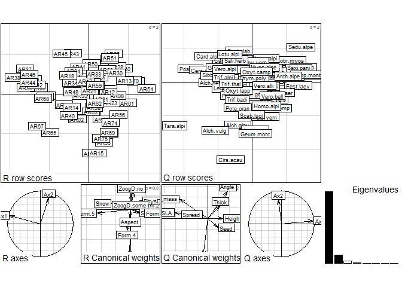
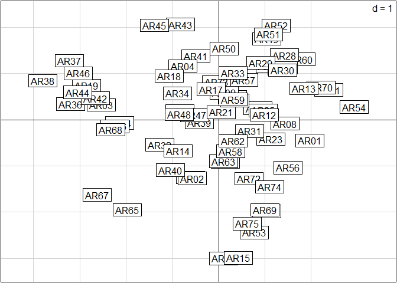
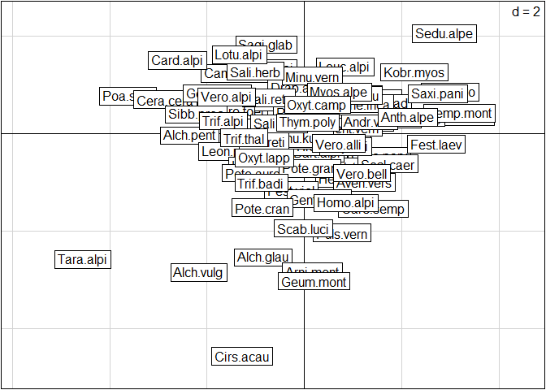
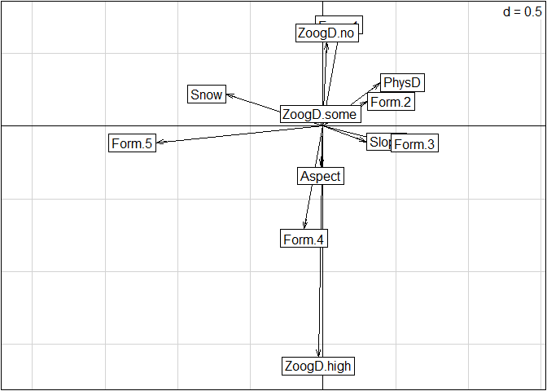
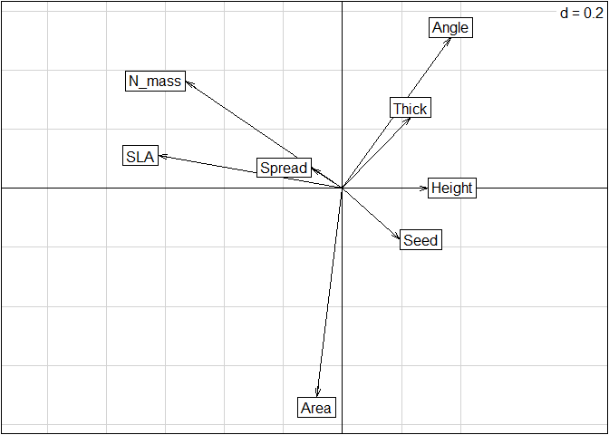
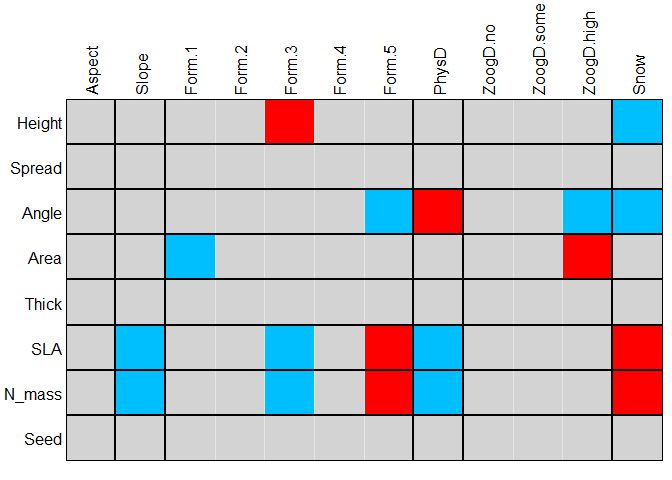
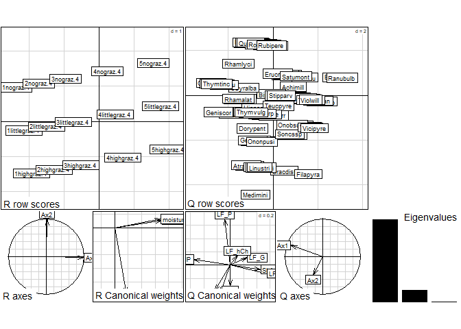
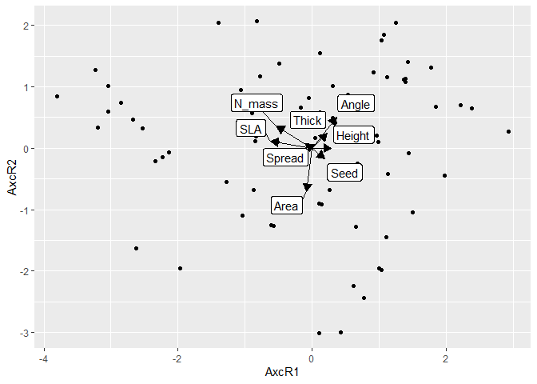
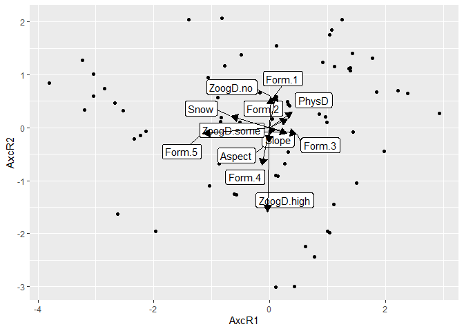

Analysis of Ecological Data <br> RLQ Analysis
================
<b>Markus Bauer</b> <br>
<b>2024-08-05</b>

- [Tasks](#tasks)
- [1 Preparation](#1-preparation)
  - [1.1 Load libraries and functions](#11-load-libraries-and-functions)
  - [1.2 Load data](#12-load-data)
- [2 RLQ Analysis](#2-rlq-analysis)
  - [2.1 Aravo data](#21-aravo-data)
    - [2.1.1 Apply the RLQ analysis](#211-apply-the-rlq-analysis)
    - [2.2.2 Repetition: Fourth-corner
      analyis](#222-repetition-fourth-corner-analyis)
  - [2.2 Spain data](#22-spain-data)
    - [2.2.1 RLQ analysis](#221-rlq-analysis)
    - [2.2.2 Use ggplot2](#222-use-ggplot2)

**Markus Bauer**

Technichal University of Munich, TUM School of Life Sciences, Chair of
Restoration Ecology, Emil-Ramann-Straße 6, 85354 Freising, Germany

<markus1.bauer@tum.de>

<https://orcid.org/0000-0001-5372-4174>

[](https://scholar.google.de/citations?user=oHhmOkkAAAAJ&hl=de&oi=ao)
[](https://github.com/markus1bauer)

# Tasks

- Use theme for Plot
- Show Ammer data

The tutorial is based on Borcard et
al. ([2018](https://doi.org/10.1007/978-3-319-71404-2), 6.11.2)

# 1 Preparation

## 1.1 Load libraries and functions

We need the `ade4` package of Dray & Dufour
([2007](https://doi.org/10.18637/jss.v022.i04)) to apply the RLQ
analysis of Dolédec et al ([1996](https://doi.org/10.1007/BF02427859))

``` r
library(here)
library(tidyverse)
library(ade4)
rm(list = ls())
```

## 1.2 Load data

The example proposed here is extracted from a tutorial written by
Stéphane Dray and provided as a Supplement to the Dray et
al. ([2014](https://doi.org/10.1890/13-0196.1)) paper ([ESA Ecological
Archives](https://esapubs.org/archive/default.htm)
[E095–002-S1](https://esapubs.org/archive/ecol/E095/002/)). The example
concerns the ecological data analysed in the Dray et
al. ([2014](https://doi.org/10.1890/13-0196.1)) paper, which describes
the response of plant traits to a snow-melting gradient in the French
Alps. The main question is: how does the snow cover duration, with all
its consequences, impact the alpine grasslands, as assessed by
functional traits of the plant species?

The data come from 75, 5 x 5 m plots located in the South-Western Alps
at about 2700 m elevation. They consist in the three following matrices:
community composition (82 species, abundance scale from 0 to 5), traits
(8 quantitative variables) and environment (4 quantitative and 2
categorical variables). To simplify this presentation, only some of the
variables that are identified as significant are presented below. Readers
are referred to Dray et al. ([2014](https://doi.org/10.1890/13-0196.1))
and Choler
([2005](https://doi.org/10.1657/1523-0430(2005)037%5B0444:CSIAPT%5D2.0.CO;2))
for a more complete interpretation of the results. The data are
available in `ade4`.

``` r
data(aravo)

species_spain <- read_delim(
  here::here("data", "raw", "bello_etal-2021", "chapter5", "speciesXplotsNE.txt"),
  col_names = TRUE, delim = "\t", col_types = cols(.default = "?")
  ) %>%
  pivot_longer(-species) %>%
  pivot_wider(names_from = "species", values_from = "value") %>%
  column_to_rownames("name")
traits_spain <- read_delim(
  here::here("data", "raw", "bello_etal-2021", "chapter5", "speciesXtraitsNE.txt"),
  col_names = TRUE, delim = "\t", col_types = cols(.default = "?")
  ) %>%
  column_to_rownames("species")
sites_spain <- read_delim(
  here::here("data", "raw", "bello_etal-2021", "chapter5", "environXplotsNE.txt"),
  col_names = TRUE, delim = "\t", col_types = cols(.default = "?")
  ) %>%
  column_to_rownames("Plots")

species_ammer <- read_csv(
  here("data", "processed", "data_processed_species.csv"),
  col_names = TRUE, col_types = cols(.default = "?")
  ) %>%
  column_to_rownames("accepted_name")
traits_ammer <- read_csv(
  here("data", "processed", "data_processed_traits.csv"),
  col_names = TRUE, col_types = cols(.default = "?")
  ) %>%
  column_to_rownames("accepted_name") %>%
  select(
    -name, -taxonomic_status, -starts_with("accepted_"), -starts_with("cv_"), -starts_with("n_")
    )
# sites_ammer <- read_csv(
#   here("data", "processed", "data_processed_sites.csv"),
#   col_names = TRUE, col_types = cols(.default = "?")
#   )
```

<a href="#top">Back to top</a>

# 2 RLQ Analysis

## 2.1 Aravo data

### 2.1.1 Apply the RLQ analysis

The method works upon three separate ordinations, one for each data
matrix and adapted to its mathematical type, and combines the three to
identify the main relationships between the environment and the traits,
as mediated by the species. It computes a generalized singular value
decomposition of the fourth-corner matrix D (Dray et
al. [2014](https://doi.org/10.1890/13-0196.1)). For the first ordination
axis, RLQ finds coefficients for the environmental variables and species
traits. These coefficients measure the contributions of individual
variables and are used to compute site and species scores; they are
chosen to maximize the first eigenvalue. The analysis proceeds in the
same way for the next, orthogonal ordination axes. For mathematical
details see Dray et al. ([2014](https://doi.org/10.1890/13-0196.1)).

After having loaded the data, the first step of the RLQ analysis is to
compute separate ordinations of the three data sets, which are computed
by function `rlq()` of `ade4` package. The ordination methods are chosen
in accordance with the mathematical types of the variables. Here,
following Dray et al. ([2014](https://doi.org/10.1890/13-0196.1)), we
compute a correspondence analysis (CA) on the species data, a principal
component analysis (PCA) on the (quantitative) trait data; for the
environmental data, which are quantitative and categorical, we will
apply a special type of PCA that can handle such types of data, called a
Hill-Smith analysis (Hill and Smith
[1976](https://doi.org/10.2307/1219449)).

The RLQ analysis is then computed on the basis of the three ordinations.

``` r
dim(aravo$spe)
```

    ## [1] 75 82

``` r
dim(aravo$traits)
```

    ## [1] 82  8

``` r
dim(aravo$env)
```

    ## [1] 75  6

``` r
# Preliminary analyses
l_aravo <- dudi.coa(aravo$spe, scannf = FALSE)
r_aravo <- dudi.hillsmith(aravo$env,  row.w = l_aravo$lw, scannf = FALSE)
q_aravo <- dudi.pca(aravo$traits, row.w = l_aravo$cw, scannf = FALSE)
```

Apply the RLQ analyis:

``` r
m1 <- rlq(
  dudiR = r_aravo, 
  dudiL = l_aravo, 
  dudiQ = q_aravo,
  scannf = FALSE
)
```

A single `plot()` command allows one to plot all results in a single
graphical window, but the individual plots are rather crowded, so we
also provide the code to plot the results separately.

``` r
plot(m1)
```

<!-- -->

``` r
m1$tab # Traits by environment crossed table
```

    ##                  Height       Spread       Angle         Area       Thick
    ## Aspect     -0.045735104 -0.044170141 -0.09083720  0.031237858 -0.05846614
    ## Slope       0.094917344 -0.017325425  0.10028197 -0.003864605  0.07415182
    ## Form.1     -0.073770286  0.026039390  0.14215018 -0.225313466  0.11572805
    ## Form.2     -0.010911331 -0.100446093  0.16807508 -0.120331757  0.03864688
    ## Form.3      0.233960654 -0.068975646  0.18296508  0.012061050  0.13483093
    ## Form.4     -0.086529686 -0.058073850 -0.23974216  0.142160619 -0.15198206
    ## Form.5     -0.252340378  0.220918447 -0.43798612  0.247700338 -0.30735550
    ## PhysD       0.113164322 -0.051680330  0.22138008 -0.134371361  0.14316173
    ## ZoogD.no    0.124267509  0.012175895  0.15202700 -0.137974965  0.03391263
    ## ZoogD.some -0.149543344 -0.008373275 -0.03745347 -0.051242752  0.01221228
    ## ZoogD.high  0.006993334 -0.013438166 -0.31869900  0.480953816 -0.11735229
    ## Snow       -0.271739531  0.065634673 -0.26961376 -0.024574466 -0.15466014
    ##                     SLA       N_mass        Seed
    ## Aspect     -0.007694551 -0.061575524  0.01159843
    ## Slope      -0.235864886 -0.201308154  0.07707397
    ## Form.1     -0.085532690  0.003024247  0.02201012
    ## Form.2     -0.246531063 -0.225091274 -0.02010957
    ## Form.3     -0.328895353 -0.290591512  0.09090024
    ## Form.4      0.043829953 -0.044209280  0.02986325
    ## Form.5      0.887669867  0.755913589 -0.22660391
    ## PhysD      -0.275524984 -0.212434381  0.07815631
    ## ZoogD.no    0.034928046  0.099790495 -0.02157176
    ## ZoogD.some -0.024512275 -0.037432290 -0.03230914
    ## ZoogD.high -0.037441256 -0.180296100  0.12984602
    ## Snow        0.481181824  0.429271163 -0.17764072

Since the plots are crowded, one can plot them one by one in large
graphical windows.

``` r
# Site (L) scores:
s.label(m1$lR)
```

<!-- -->

``` r
# Species (Q) scores
s.label(m1$lQ)
```

<!-- -->

``` r
# Environmental variables:
s.arrow(m1$l1)
```

<!-- -->

``` r
# Species traits:
s.arrow(m1$c1)
```

<!-- -->

The script below concludes with a global “model 6” test (after ter Braak
et al. [2012](https://doi.org/10.1890/12-0126.1)). The two tests
included in “model 6” yielded a combined p-value = 0.001, hence the null
hypothesis is rejected, which means that both links, L-Q and R-L, are
significant.

The permutation models are the following, considering matrix L (or A)
with observations in the rows and species as columns:

- Model 2: environmental control over species assemblages. Permute
  entire rows of matrix L (A). H0 states that the species compositions
  of the sites are unrelated to the environmental conditions. This model
  considers that species assemblages must be taken as whole entities,
  which are preserved through the permutations, and react as such to
  environmental constraints.

- Model 4: random species attributes. Permute entire columns of matrix L
  (A). H0 states that species are distributed according to their
  preferences for site conditions (this is preserved through the
  permutations), but independently from their traits.

- Model 6: this is actually a combination of models 2 and 4. A first form
  of this combination was proposed by Dray and Legendre
  ([2008](https://doi.org/10.1890/08-0349.1)), who noted, however, that
  it suffered from a strong inflation of type I error rate when L (A) is
  only linked to one other table (R or Q). Ter Braak et
  al. ([2012](https://doi.org/10.1890/12-0126.1)) proposed to overcome
  this problem by considering the two tests sequentially and rejecting
  the overall null hypothesis (i.e., traits and environment unrelated)
  only if both tests (models 2 and 4) reject H0 at the alpha level. The
  maximum p-value becomes the overall p-value. These authors showed that
  this procedure ensures a correct level of type I error and a good
  power if the number of species is sufficient (at least 30).

``` r
randtest(m1, nrepet = 999, modeltype = 6)
```

    ## class: krandtest lightkrandtest 
    ## Monte-Carlo tests
    ## Call: randtest.rlq(xtest = m1, nrepet = 999, modeltype = 6)
    ## 
    ## Number of tests:   2 
    ## 
    ## Adjustment method for multiple comparisons:   none 
    ## Permutation number:   999 
    ##      Test     Obs  Std.Obs   Alter Pvalue
    ## 1 Model 2 1.57836 27.01895 greater  0.001
    ## 2 Model 4 1.57836 13.40434 greater  0.001

The results are interpreted as follows by Dray et
al. ([2014](https://doi.org/10.1890/13-0196.1)): “The left (negative)
part of the first RLQ axis identifies species (*Poa supina*, *Alchemilla
pentaphyllea*, or *Taraxacum alpinum*) with higher specific leaf area
(SLA) and mass-based leaf nitrogen content (NMass), lower height, and a
reduced seed mass. These species were mostly found in late-melting
habitats. The right part of the axis highlights trait attributes
(upright and thick leaves) associated with convex landforms, physically
disturbed and mostly early-melting sites. Corresponding species are
*Sempervivum montanum*, *Androsace adfinis*, or *Lloydia serotina*. The
second RLQ axis outlined zoogenic disturbed sites located in concave
slopes. These habitats were characterized by large-leaved species
(*Cirsium acaule*, *Geum montanum*, *Alchemilla vulgaris*).”

### 2.2.2 Repetition: Fourth-corner analyis

The same data will now be submitted to a fourth-corner analysis, which
provides tests at the bivariate level, i.e. one trait and one
environmental variable at a time. This is where the correction for
multiple tests is necessary. Given the large number of permutations
needed to reach an adequately precise estimation of the p-value, the
most astute way of computing this analysis consists in a first
computation without any correction for multiple testing. The resulting
object can be corrected afterwards. So, if several types of corrections
must be examined, there is no need to recompute the whole analysis and
its large and time-consuming number of permutations.

The fourth-corner analysis is computed by means of the function
`fourthcorner()` of `ade4`, using model 6 advocated by Dray et
al. ([2014](https://doi.org/10.1890/13-0196.1)).

``` r
fourth.aravo <- fourthcorner(
  tabR = aravo$env,
  tabL = aravo$spe,
  tabQ = aravo$traits,
  modeltype = 6,
  p.adjust.method.G = "none",
  p.adjust.method.D = "none",
  nrepet = 49999
)
```

The correction for multiple testing is taken care of by the function
`p.adjust.4thcorner()`, which operates on the output object of the
analysis. Here the false discovery rate is used (FDR).

``` r
fourth.aravo.adj <- p.adjust.4thcorner(
  fourth.aravo,
  p.adjust.method.G = "fdr",
  p.adjust.method.D = "fdr",
  p.adjust.D = "global"
) 
```

We will first plot the results as a table with coloured cells.

``` r
plot(fourth.aravo.adj, alpha = 0.05, stat = "D2")
```

<!-- -->

This representation allows a detailed interpretation. For instance, SLA
(specific leaf area) and N_mass (mass-based leaf nitrogen content) are
positively associated with Snow (mean snow melt date) and Form.5
(concave microtopography), features that can also be observed in the
ordination. This shows that these traits are likely to favor species
that tolerate a longer period of snow cover: a higher nitrogen content,
partly due to nitrogen storage in snowpacks and partly to the protective
effect of snow on soil temperature and water content (Choler
[2005](https://doi.org/10.1657/1523-0430(2005)037%5B0444:CSIAPT%5D2.0.CO;2)),
warrants larger reserves, and a larger leaf area allows a larger rate of
photosynthesis once the plant iseventually exposed to the sun.
Conversely, these two traits are negatively associated with PhysD
(physical disturbance due to cryoturbation), which tends to occur more
often in areas without snow and therefore more exposed to large
temperature oscillations.

## 2.2 Spain data

### 2.2.1 RLQ analysis

``` r
l_spain <- dudi.coa(species_spain, scannf = FALSE)
r_spain <- dudi.hillsmith(sites_spain,  row.w = l_spain$lw, scannf = FALSE)
q_spain <- dudi.pca(
  traits_spain %>% select(-GrowhtForm), row.w = l_spain$cw, scannf = FALSE
  )
```

``` r
m2 <- rlq(
  dudiR = r_spain, 
  dudiL = l_spain, 
  dudiQ = q_spain,
  scannf = FALSE
)
```

``` r
randtest(m2, nrepet = 999, modeltype = 6)
```

    ## class: krandtest lightkrandtest 
    ## Monte-Carlo tests
    ## Call: randtest.rlq(xtest = m2, nrepet = 999, modeltype = 6)
    ## 
    ## Number of tests:   2 
    ## 
    ## Adjustment method for multiple comparisons:   none 
    ## Permutation number:   999 
    ##      Test       Obs   Std.Obs   Alter Pvalue
    ## 1 Model 2 0.8733604 28.989218 greater  0.001
    ## 2 Model 4 0.8733604  8.821007 greater  0.001

### 2.2.2 Use ggplot2

First, the standard plot:

``` r
plot(m2)
```

<!-- -->

Now, we have to prepare the data for ggplot2. Get the scores of the
sites, species, environmental variables and functional traits:

``` r
# Site (R) scores:
scores_sites <- m1$lR %>%
  rownames_to_column("plot_id")
# Species (Q) scores
scores_species <- m1$lQ %>%
  rownames_to_column("name")
# Environmental variables:
scores_env <- m1$l1 %>%
  rownames_to_column("env_factor")
# Species traits:
scores_traits <- m1$c1 %>%
  rownames_to_column("trait")
```

Use `ggrepel` to avoid overlapping text labels
([Vignette](https://ggrepel.slowkow.com/articles/examples), Slowikowski
[2024](https://CRAN.R-project.org/package=ggrepel))

``` r
library(ggrepel)
ggplot() +
  geom_point(data = scores_sites, aes(x = AxcR1, y = AxcR2)) +
  geom_label_repel(
    data = scores_traits,
    aes(x = CS1, y = CS2, label = trait)
    ) +
  geom_segment(
    data = scores_traits, aes(x = 0, y = 0, xend = CS1, yend = CS2),
    arrow = arrow(length = unit(0.3, "cm"), type = "closed")
    )
```

<!-- -->

``` r
library(ggrepel)
ggplot() +
  geom_point(data = scores_sites, aes(x = AxcR1, y = AxcR2)) +
  geom_label_repel(
    data = scores_env,
    aes(x = RS1, y = RS2, label = env_factor)
    ) +
  geom_segment(
    data = scores_env, aes(x = 0, y = 0, xend = RS1, yend = RS2),
    arrow = arrow(length = unit(0.3, "cm"), type = "closed")
    )
```

<!-- -->

- Try the same with the Ammer data and your data
